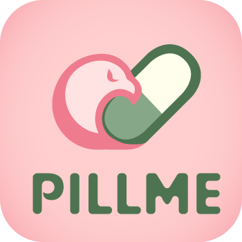

# 💊복약 관리의 새로운 방법, PILLME

<div align="center">



(로고는 현재 수정 중입니다.)

</div>

## 프로젝트 소개

- PILLME는 복용해야 하는 약물을 처방전 또는 처방 봉투를 기반으로 추가하고, 주기적인 알람 설정을 통해서 매일 정해진 시간에 사용자에게 복약 알림을 제공하는 서비스입니다.
- 관리 대상 등록 기능을 통해 보호자가 복약 관리를 대신 할 수 있습니다.
- 유저가 지속적으로 운동 및 건강 관리 습관에 동기부여를 받을 수 있도록 커뮤니티 형식의의 건강 챌린지 서비스를 제공합니다.

<br>

## 팀원 구성

<div align="center">

|                                                           **조승근**                                                            |                                                                               **임태훈**                                                                                |                                                                 **오세학**                                                                  |                                                                                         **정예영**                                                                                         |                                                             **이화정**                                                             |                                                          **백지원**                                                           |
| :-----------------------------------------------------------------------------------------------------------------------------: | :---------------------------------------------------------------------------------------------------------------------------------------------------------------------: | :-----------------------------------------------------------------------------------------------------------------------------------------: | :----------------------------------------------------------------------------------------------------------------------------------------------------------------------------------------: | :--------------------------------------------------------------------------------------------------------------------------------: | :---------------------------------------------------------------------------------------------------------------------------: |
|  <br/> 팀장 <br/> BE 총괄 |  <br/> BE <br/> <br/> |  <br/> BE <br/> <br/> |  <br/> BE <br/> <br/> |  <br/> FE 총괄 <br/> <br/> |  <br/> FE <br/> <br/> |

</div>

## 1. 기술 스택

### ✔️Front-end


### ✔️Back-end


### ✔️Design


### ✔️Infra


### ✔️CI/CD


### ✔️Collaboration


<br>

## 2. 브랜치 전략과 컨벤션

### 브랜치 전략

- Git-flow 전략을 기반으로 main, develop 브랜치와 feature 보조 브랜치를 운용했습니다.
- main, develop, Feat 브랜치로 나누어 개발을 하였습니다.
  - **main** 브랜치는 배포 단계에서만 사용하는 브랜치입니다.
  - **dev** 브랜치는 개발 단계에서 git-flow의 master 역할을 하는 브랜치입니다.
  - **feat/[issue number]** 브랜치는 기능 단위로 독립적인 개발 환경을 위하여 사용합니다. 기능 완성 시 PR 생성 후 dev 브랜치로 merge 했습니다.

### 이슈 발행 템플릿

- 기능 구현

```
## 기능 설명

> 추가하려는 기능에 대한 간결한 설명

## 작업 상세 내용

- [ ] TODO
- [ ] TODO

## 참고할만한 자료(선택)
```

- 버그 fix

```
## 버그 설명

> 어떤 버그인지 간결한 설명

## 어떤 상황에서 발생한 버그인가요?

> (가능하면) Given-When-Then 형식으로 서술

## 예상 결과

> 정상적인 동작 서술

## 참고할만한 자료(선택)
```

### MR 신청 템플릿

```
## #️⃣연관 이슈

> ex) #이슈번호, #이슈번호

## 📝작업 내용

> 이번 PR에서 작업한 내용을 간략히 서술(이미지 첨부 가능)

### 스크린샷 (선택)

## 💬리뷰 요구사항(선택)

> 특정 부분에 대한 리뷰 요청
>
> ex) 메서드의 이름 등
```

### 커밋 컨벤션

- `feat` : 새로운 기능 추가
- `fix` : 버그 수정
- `docs` : 문서 내용 변경
- `design` : CSS 등 사용자 UI 디자인 변경
- `style` : 포맷팅, 세미콜론 누락, 코드 변경이 없는 경우
- `refactor` : 코드 리팩토링
- `chore` : 빌드 수정, 패키지 매니저 설정, 운영 코드 변경이 없는 경우
- `rename` : 파일 혹은 폴더명을 수정하거나 옮기는 작업만인 경우
- `remove` : 파일을 삭제하는 작업만 수행한 경우

### DTO 구조

1. DTO 구조는 항상 `record` 를 유지하도록 한다. (데이터 클래스를 통한 관리는 지양)
2. `request` 패키지와 `response` 패키지에 속한 DTO는 `___Dto` 이름이 아닌 `___Request` / `___Response` 로 명명하도록 한다.

### 엔티티 원칙

1. 엔티티 역시 `setter`를 사용하지 않고, 특수한 기능을 가진 메소드를 설계하도록 한다. 예를 들어 어떤 게시글 엔티티의 `content` 필드를 수정하는 로직은 `setContent(String str)` 으로 가능하지만, 이는 메소드의 책임을 망친다. 따라서 `update(String str)`등의 비즈니스 로직에 적절한 메소드 이름을 설계하는 방향으로 생각해야 한다. (`getter` / `setter` 는 사용하면 안된다)

### DI 원칙

1. DI를 사용할 때에는 해당 클래스가 스프링 빈으로 관리되어야 하는 이유를 고려 해야 한다.
2. DI는 `private final` 제한자를 붙인 클래스를 대상으로 `@RequiredArgsConstructor`를 사용하도록 고려 한다. (lombok 적극 활용으로 개발 편의성 증가)

### 책임 규칙

1. 메소드 또는 클래스는 항상 단일한 책임을 가지도록 생각해야 한다. 단일한 책임이란 하나의 업무를 말하며, 하나의 업무 이상의 책임을 가지는 설계는 지양해야 한다.
2. 이에 따라서 메소드, 클래스, 변수의 명명 또한 책임을 고려하여 명확하게 작성하도록 한다. 잘 지어진 이름은 변수를 일정 부분 대체한다.
3. 어떠한 메소드가 해당 클래스 내에서만 사용된다면(비즈니스 로직의 달성을 위한 독자적인 메소드) 반드시 `private` 접근 제한자를 선언한다.

### 주석

1. 쉬운 로직일지라도 코드 습관에 따라서 타인이 알아보지 못할 수 있다. 따라서 비즈니스 로직에 대한 주석을 최대한 작성하도록 한다.

### 설계의 확장

1. 설계의 확장성을 위해 비슷한 기능을 하지만 사소하게 다른 코드는 메소드 이름을 일치 시켜 나중에 인터페이스로 분리하기 쉽도록 설계한다.

### 응답 규칙

응답은 다음과 같은 형식을 따른다.

```java
@JsonPropertyOrder({"isSuccess", "code", "message", "result"})
public record JSONResponse<T>(
        @JsonProperty(value = "isSuccess") boolean isSuccess,
        int code,
        String message,
        @JsonInclude(Include.NON_NULL) T result
) {

    public static <T> JSONResponse<T> onSuccess(T data) {
        SuccessCode code = SuccessCode.REQUEST_SUCCESS;
        String message = MessageUtil.getMessage(code.name());
        return new JSONResponse<>(true, code.getCode(), message, data);
    }

    public static <T> JSONResponse<T> of(SuccessCode successCode, T data) {
        String message = MessageUtil.getMessage(successCode.name());
        return new JSONResponse<>(true, successCode.getCode(), message, data);
    }

    public static <T> JSONResponse<T> onFailure(ErrorCode errorCode, T data) {
        String message = MessageUtil.getMessage(errorCode.name());
        return new JSONResponse<>(false, errorCode.getCode(), message, data);
    }
}
```

```jsx
{
	isSuccess: Boolean,
	code: ResponseCode,
	message: ResponseMessage,
	result: Object || Array
}
```

`code` 는 REST API 에서 정의한 독자적인 규격으로 이를 통해서 클라이언트에서 특정한 처리가 가능하다.

<br>

## 3. 프로젝트 구조

### Use Case


<br>

### 정보구조도


<br>

## 4. 역할 분담

### 조승근

- **기능**
  - 채팅 기능
    <br>

### 임태훈

- **기능**
  - 복약 알림 기능
    <br>

### 오세학

- **기능**
  - 복용 약물 등록, 관리
    <br>

### 정예영

- **기능**
  - 회원가입 및 본인 인증
    <br>

### 이화정

- UI/UX 디자인
  <br>

### 백지원

- UI/UX 디자인
  <br>

## 5. 개발 기간 및 작업 관리

### 개발 기간

- 전체 개발 기간 : 2024-01-13 ~

<br>

### 작업 관리

- Jira를 활용하여 프로젝트 일정을 관리했습니다.

<br>
