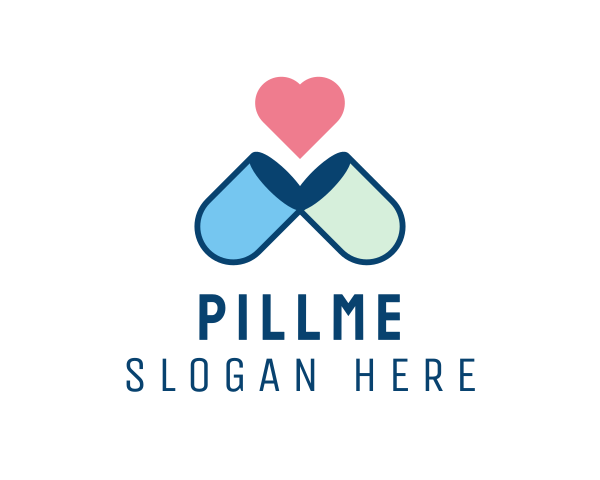
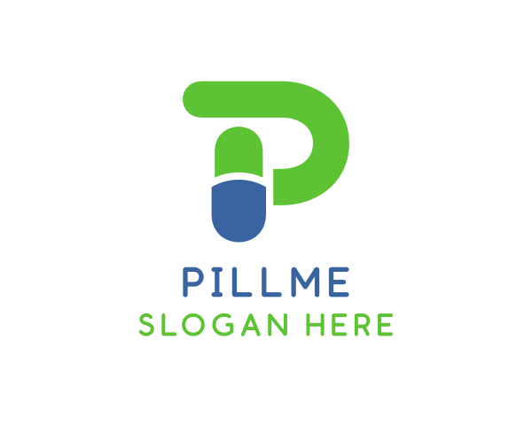

# 250113

## 지라 사용법

### 지라

업무와 일정을 계획, 관리하기 위해 사용

### 폭포수 모델

- 프로젝트의 각 단계가 순차적으로 수행, 이전 단계로 돌아가지 않음.
- 변화에 대한 대처 능력이 떨어짐.

### 에자일 방식

- 유연한 프로젝트 관리가 가능함.
  -> 지라는 에자일 방식 보드판의 역할을 함.
- 큰 프로젝트를 작은 단위로 분할하여 진행
- 짧은 스프린트 단위로 개발하며 지속적으로 피드백 반영

### 일의 단위

- 에픽
  - 큰 단위의 작업
  - ex) 사용자 계정 및 인증 시스템 구현
- 스토리
  - 사용자 관점에서의 업무 단위
  - 에픽의 하위 작업
- 테스크
  - 개발자 관점에서의 업무 단위
  - 스토리 실현을 위한 세부 작업

### 백로그

- 완료되지 않은 작업 항목들의 목록
- 언제든지 자유롭게 이슈를 작성해서 등록

### 스프린트 로그

- 특정 스프린트동안 수행하기로 약속한 작업 항목들의 목록
- 백로그에서 우선순위가 높은 항목들을 차례대로 스프린트 로그로 이동
- 월요일 아침 팀 회의를 통해 스프린트 로그를 작성하는 것을 추천

### 업무 관리

#### 에픽 생성

1. 프로젝트의 왼쪽 메뉴에서 타임라인 탭 선택[
2. "+ Create Epic" 버튼 클릭
3. 에픽 이름 입력
4. 에픽 세부사항 설정

#### 스토리 생성

1. 백로그 화면으로 이동
2. "Create" 버튼 클릭
3. 이슈 타입에서 "Story" 선택
4. 필수 정보 입력
   - 프로젝트 선택
   - 스토리 제목
   - 설명
   - 에픽 연결

#### 스토리 관리

- 생성된 스토리는 자동으로 백로그에 추가
- 우선순위에 따라 드래그 앤 드롭으로 순서 조정 가능
- 스프린트 계획 시 백로그에서 스토리를 선택하여 스프린트로 이동

#### 스토리 포인트

- 싸피
  - 1시간의 업무량을 기준으로 1점으로 표현
  - 단순해서 포인트를 선정하기 쉽지만, 이 경우 학습으로 인한 시간도 업무량으로 표현되어 제대로 된 업무량이 추산되지 않을 수 있음.
- 현업
  - 작업에 들어가는 노력의 양을 임의로 추정하여 포인트 분배
    -> 두 가지 방법 모두 익숙해질 것.

#### 우선순위 설정

- 5단계 체계로 이루어져있음.
- 중요도 기반으로 백로그가 정렬

#### 스프린트 로그

모든 이슈를 옮겨 스프린트 로그를 작성한 이후 스프린트 시작 할 것.
그렇지 않으면 번다운 차트 사용 시 오류가 발생하고는 함.

### 스크럼 보드

- 스프린트 내 작업의 진행 상황과 소유권을 시각화하는 프로젝트 관리 도구
- 팀 전체가 동일한 정보를 공유하며 투명한 협업 가능
- 작업의 병목 현상을 조기에 발견하고 해결 가능
- 우선순위 기반 작업 관리
- 일일 피드백과 변화하는 우선순위에 따른 유연한 워크플로우 조정

### 번다운 차트

- 남은 작업량과 시간을 시각적으로 비교하여 진행 상황을 추적
- 스프린트나 프로젝트의 완료 시점 예측에 활용
- 프로젝트 진행 상황의 명확한 시각화
- 팀의 작업 속도와 생산성 측정

#### 차트 구성요소

- X축: 시간(스프린트 기간)
- Y축: 남은 작업량(스토리 포인트)
- 이상적 추세선: 일정한 속도로 작업이 완료되는 이상적 시나리오
- 실제 추세선: 실제 작업 진행 상황

## 아이디어 회의

### Fillme 피드백

- 처방전 양식이 동일하지 않으면 ocr로 정보를 뽑아낼 시 정확도 및 시간이 오래걸리는 문제가 발생할 수 있음
- 주제가 흔함
- 데이터 베이스 조회 속도 문제 개선
- 왜 약사의 승인이 필요한가??(법적으로 문제가 되지 않을까?) - pass
  - 단순 체크 용도
  - 프로젝트 목적을 분명히해서 약사의 승인이 필요하지 않은 부분을 명확하게 어필할 것
- 프로젝트 사이즈
  - 목적이 어디에 있느냐.
- 웹 뷰에 어울리는 서비스인가?
  - 개인정보 보호에 대한 준비 필요 : 보안에 대해 고민하고 또 고민할 것
  - 기기 자체에 데이터를 가지고 있는 경우

### FairFare 피드백

- 실직적인 테스트 문제(현실적인 문제)
- 이득을 보는게 누구인가?
  - 소비자인가 택시 기사인가. 주체를 명확히 할 것.
- 유저가 확보가 되어야 효력이 발생하는 컨텐츠는 평가가 좋지 않았던 경우가 많음.
- 사용자에게 기대야하는 서비스는 지양해야 함.
  - 택시가 버스가 되는 느낌으로 확장하는 것은 어떤가
    - 고정적인 루트를 지정하여 택시 기사와 사용자가 선택
- 성능 측정이 힘들 것.
- 아이디어를 틀어서 카풀로 간다면 비즈니스 협력 문제에 대한 부담은 줄어들 것.
- 노쇼, 신뢰성 같은 문제는 지금 단계에서 고민할 문제는 아님.
- 실제 테스트가 필요한 핵심 기능과 아닌 부분을 분리
  - 누가 이득을 볼 것인가에 대한 고민을 먼저할 것.
- 해결하려는 패인 포인트가 무엇인가에 대한 고민이 부족함.
  - 누구를 위한 것인가?
  - 너무 많은 사람을 대상으로 하지 않아도 됨. 소수를 대상으로 명확하게
  - 해결목적
  - 공감할 수 있는 주제로 가져갈 것.

### 본인 취미 관심사 관련 주제 빌드업

- 술
  - 본인이 마신 술에 대한 향, 맛 등을 기록하는 노트
  - 기본적인 칵테일 레시피 공유
  - 각자의 커스텀 칵테일 레시피 공유
  - 셀프 양조를 체험하고 싶은 이들을 위한 경험자의 레시피 및 노하우 공유
  - 전통주 브랜드 소개
- 낚시
  - 본인이 잡은 물고기를 기록하는 2D 어항 서비스
  - 기록을 기반으로 유저끼리 진행하는 월별 명예의 전당 서비스
  - 본인이 방문한 낚시 포인트 체크하는 전국 지도 서비스

# 250114

## Commit Convention

🧑‍🌾 예시 )

```
feat: 회원가입 기능 구현
- 이메일 유효성 검사 closes #이슈번호
```

- `feat`: 새로운 기능 추가
- `init` : 프로젝트 초기 세팅
- `fix`: 버그 수정
- `docs`: 문서 수정
- `Refactor`:코드 리팩토링을 했을 때
- `Chore`: 외부 라이브러리 임포트 등의 작업을 완료했을 때
- `test` : 테스트 진행 시
- `deploy` : 배포를 위한 커밋
- `WIP` : 코드 작업 중 백업을 위한 커밋

## 백엔드 코드 컨벤션

### 패키지 구조

```jsx

com.example.project

├── domain
│   └── login
│       ├── controller
│       ├── dto
│       │   ├── request
│       │   │   └── UserCreateRequest.java
│       │   └── response
│       │       └── UserDetailResponse.java
│       ├── entity
│       │   └── User.java
│       ├── repository
│       ├── service
│       └── mapper
│           └── UserMapper.java
├── global
│   ├── config
│   ├── error
│   ├── security
│   └── util
└── common
    ├── entity
    ├── dto
    └── annotation
```

### DTO 설계

### **네이밍 컨벤션**

#### **요청 DTO**

- 생성: **`{Entity}CreateRequest`**
- 수정: **`{Entity}UpdateRequest`**
- 검색: **`{Entity}SearchRequest`**

#### **응답 DTO**

- 목록: **`{Entity}ListResponse`**
- 상세: **`{Entity}DetailResponse`**
- 요약: **`{Entity}SummaryResponse`**

# 250115

## Git

### 저장소 (Repository)

- 코드의 전체 역사가 담긴 공간
- .git 폴더에 모든 변경사항이 기록
- 저장소는 두 가지 형태로 운영

  - 로컬 저장소
    - git init 명령어로 생성
    - 개발자의 로컬 환경에서 직접 관리
    - 변경사항을 즉시 추적하고 기록
  - 원격 저장소
    - 팀 협업을 위한 중앙 저장소
    - git push를 통해 변경
    - GitHub, GitLab 등의 플랫폼 활용

- GitHub vs GitLab 비교 분석

  - GitHub

    - 사용자 경험

      - 직관적이고 단순한 인터페이스로 초보자도 쉽게 접근 가능
      - 개발자 중심의 워크플로우로 버전 관리 학습이 용이
      - 빠른 배포와 간단한 워크플로우 중심

    - 커뮤니티와 생태계

      - Stack Overflow 설문 기준 개인 프로젝트의 87.02%가 GitHub 사용
      - 전문 프로젝트의 55.93%가 GitHub 선호
      - 374개 이상의 무료 앱과 다양한 유료 옵션 제공

    - 협업과 통합
      - GitHub Marketplace를 통한 풍부한 서드파티 통합
      - 오픈소스 프로젝트를 위한 토론과 위키 기능 제공
      - 더 넓은 개발자 커뮤니티와의 협업 기회

  - GitLab

    - 기업 환경 최적화

      - 기업용 미션 크리티컬 솔루션 구축에 최적화
      - 더 강력한 보안 기능과 접근 제어
      - 자체 관리형 옵션으로 더 큰 유연성 제공

    - 통합 개발 환경
      - 내장된 CI/CD 파이프라인
      - 더 포괄적인 프로젝트 관리 도구
      - 단일 인터페이스에서 모든 개발 라이프사이클 관리

  -> GitHub를 선택하는 주된 이유는 더 넓은 커뮤니티, 사용 편의성, 그리고 풍부한 서드파티 통합

  -> GitLab은 엔터프라이즈급 기능과 보안을 중시하는 조직에 더 적합

### 커밋 (Commit)

변화의 순간을 기록하는 스냅샷

- 완성된 기능 단위로 커밋
- 작은 단위의 변경사항으로 구성
- 기능별 세분화된 커밋 권장

### 브랜치 (Branch)

- 아이디어를 실험하고 구현하는 독립적인 공간.
- 브랜치 전략

  - GitFlow 구조

    - **Main(Master) 브랜치**: 제품 출시 이력을 관리하는 메인 브랜치
    - **Develop 브랜치**: 개발 진행 상황을 통합하는 브랜치
    - **Feature 브랜치**: Develop에서 분기하여 기능 개발을 진행
    - **Release 브랜치**: 출시 준비를 위한 브랜치로, Develop에서 분기
    - **Hotfix 브랜치**: Main에서 직접 분기하여 긴급 버그 수정

  - GitHub Flow 구조

    - **Main 브랜치**: 항상 배포 가능한 상태를 유지하는 단일 메인 브랜치[
    - **Feature 브랜치**: Main에서 직접 분기하여 기능 개발 후 다시 Main으로 병합
    - 릴리스 브랜치 없이 단순한 구조 유지

  - Trunk-Based Development 구조

    - **Trunk(Main) 브랜치**: 모든 개발이 이루어지는 단일 브랜치
    - **단기 Feature 브랜치**: 필요한 경우에만 생성하며 몇 시간 내로 Trunk에 병합
    - 브랜치의 수명을 최소화하고 지속적인 통합을 강조

  - GitFlow가 가장 복잡한 구조
  - GitHub Flow와 Trunk-Based Development는 상대적으로 단순한 구조

- 브랜치 전략 수립(16일 진행 예정)

### 병합 (Merge)

아이디어 결과물을 프로젝트에 반영

- MR(Merge Request)과 PR(Pull Request)

  - 코드 리뷰가 포함된 병합기능.
  - GitLab에서는 MR, GitHub에서는 PR이라는 용어 사용

- Git merge와의 차이
  - Git merge 명령어는 실제 코드를 합치는 기술적 작업
  - MR/PR은 코드 리뷰와 협업을 위한 더 넓은 개념

### 커밋메세지 컨벤션

- 제목과 본문을 빈 줄로 구분
- 제목은 50자 이내로 제한
- 현재형 명령문 사용
- 본문에서는 변경 이유와 내용 설명
- 이슈 번호 참조로 추적성 확보

- 팀 컨벤션 논의(16일 진행 예정)

## 피드백

### AI 구현 전략

**OCR 및 이미지 처리**

- 단순 AI 사용이 아닌 이미지 전처리 과정 구현이나 OCR 기능에 초점
- 약봉투 정보 추출은 포맷에 따라 로직 복잡도 조절

**개발 우선순위**

- AI 구현에 최우선 순위 부여
- 지역 범위를 제한하여 점진적 확장 모델 구축
- 다양한 각도와 회전 테스트로 정확도 검증 (1000장 이상)

### 데이터 아키텍처

**데이터베이스 설계**

- API 조회보다 DB 저장 방식 권장
- 정기적 스케줄러로 데이터 업데이트
- 엘라스틱서치 도입으로 연관 검색 기능 구현

**보안 및 개인정보**

- 개인정보 및 복용 약물 정보 암호화 저장
- 스프링 시큐리티를 통한 데이터 접근 제어
- 서버 보안 강화 및 개인정보보호법 준수

### 애플리케이션 개발

**플랫폼 선택**

- PWA 대신 하이브리드 앱 개발 권장
- 카메라 기능이 중요한 경우 플러터 고려
- 하드웨어 성능 활용도 고려

**개발 방법론**

- 단계적 구현 후 고도화 접근
- 명확한 유저 플로우 설계
- 성능 개선을 위한 단계별 튜닝

### 알림 시스템

- 대규모 사용자 고려 시 카프카 도입 검토

## Flow

### 메인 화면

- 로그인
  - 로컬
  - 소셜
- 회원가입
  - 로컬
  - 소셜

### 로그인 이후

- 복용자 상태관리
- 캘린더
  - 복용기간
  - 복용약
  - 복용여부
- 알림
  - 유저
    - 내가 복용하는 약 시간에 맞춰 알림
    - 피부양자 등록 요청 알림
  - 관리자
    - 내 피부양자가 약을 복용하지 않았을 시 알림
    - 피부양자의 복용 상태가 변경되었을 시 알림
  - 피부양자
    - 내 관리자가 나에게 보내는 알림
- 약 정보 기록하기
  - 처방전
  - 약봉투
  - 셀프 등록 → 모든 기능은 유저 컨펌 완료 후 업로드

### 처방전 및 약봉투 분석

사용자 이미지 입력 → (이미지 전처리 → OCR) → LLM → DB 조회 → 데이터 응답

**_괄호 안의 기능은 뒤의 기능을 개발하는 데에 있어 영향을 주지 않으므로 우선적으로 사용자 입력을 전제로 기능을 개발 후 이미지 전처리와 OCR 기능을 구현하는데 치중_**

- 응답 데이터
  - 필수
    - 병원(메모기능)
    - 약국
    - 약 이름
  - OCR 기능 고도화를 통해 가능한 경우 → 불가능한 경우 사용자 입력으로 전환
    - 처방받은 날짜
    - 복용기간
    - 복용 횟수

## 로고 디자인

### 생성형 AI를 활용한 로고 제작

[로고제작 사이트](https://www.design.com/)







### 일러스트레이터를 활용한 로고 수정

[색상차트 사이트](https://colorhunt.co/)


# 250116

## 개인 생산성

### GTD

- Getting Things Done
- 머릿속에 정보를 저장하고 추적할수록 생산성과 집중력이 낮아진다는 신념을 기반으로 만들어졌다
- **기본 개념**
  - 모든 할 일과 정보를 머릿속이 아닌 외부 시스템에 체계적으로 정리하고 기록
  - 이를 통해 스트레스를 줄이고 창의적인 일에 집중할 수 있는 환경 구축
- **5단계 프로세스** 1. 수집: 모든 할 일을 물리적으로 수집 2. 명료화: 수집된 항목들을 정리하고 명확히 함 3. 정리: 할 일들을 카테고리 별로 분류 4. 검토: 주간 단위로 전체 목록을 검토 5. 실행: 정리된 할 일들을 실제로 수행
- **주요 특징**
  - 2분 원칙: 2분 안에 할 수 있는 일은 즉시 처리
  - 프로젝트 관리: 2개 이상의 행동이 필요한 일은 프로젝트로 관리
  - 콘텍스트 분류: 할 일을 장소나 상황별로 분류하여 관리

### 뽀모도로

- **기본 구조**
  - 25분 집중 작업 후 5분 휴식을 반복
  - 4회 반복 후에는 30분의 긴 휴식 시간 부여
- **효과적인 이유**
  - 초두 효과: 학습 초반부 내용을 잘 기억하는 현상
  - 최신 효과: 마지막 부분을 잘 기억하는 현상
  - 짧은 주기로 인한 반복적인 초두/최신 효과 발생
- **권장하는 휴식 활동**
  - 잠시 일어나 걷기
  - 물 마시기
  - 눈 휴식하기
  - 깊은 호흡하기
- **피해야 할 활동**
  - 휴대폰이나 노트북 사용
  - 이메일 확인
  - 인터넷 서핑

## 백엔드 코드컨벤션

### DTO 구조

- **기본 개념**:
  - DTO(Data Transfer Object)
    - 순수하게 데이터 전송을 위한 객체. 데이터를 전달하는 동작만을 수행
    - 비즈니스 로직 포함 x
    - 클라이언트의 데이터를 받는 역할을 하며, 외부에 노출되어도 무방
  - Model
    - 비즈니스 로직과 데이터를 함께 다루는 객체
    - 비즈니스 데이터를 담고 가공하는 역할 수행
    - DTO와 Entity를 포함하여 애플리케이션 전체의 데이터를 표현하는데 사용
- **규칙**:

  1.  `record` 사용: 불변성과 간결성 보장
  2.  명명 규칙: `___Dto` 단 `request` 패키지와 `response` 패키지에 속한 DTO는 `___Dto` 가 아닌 `___Request` / `___Response` 사용

- **기술 설명**:

  - `record`: Java 14에서 도입된 불변 데이터 클래스
  - `static` 팩토리 메서드 (`of`): 객체 생성의 유연성 제공

    - 생성자 대신 객체 생성을 담당하는 static 메서드

    ```java
    public class Order {
        private final String orderId;
        private final String customerName;

        // private 생성자
        private Order(String orderId, String customerName) {
            this.orderId = orderId;
            this.customerName = customerName;
        }

        // static 팩토리 메서드
        public static Order of(String orderId, String customerName) {
            return new Order(orderId, customerName);
        }
    }
    ```

    ```java
    // 기본적인 객체 생성
    public static Order of(String orderId)

    // 여러 파라미터로 객체 생성
    public static Order from(String orderId, String customerName)

    // 단일 값으로 객체 생성
    public static Order valueOf(String value)

    // 캐싱된 인스턴스 반환
    public static Order getInstance()

    // 새로운 인스턴스 생성 보장
    public static Order newInstance()
    ```

- **이점**:
  - 코드 간결성
  - 불변성으로 인한 안전성
  - 명확한 의도 전달

### 엔티티 원칙

- **기본 개념**:
  - 엔티티
    - 비즈니스 도메인 객체
    - 데이터베이스 테이블과 1:1로 매핑
    - @Entity 어노테이션으로 정의
    - 반드시 기본키(@Id)를 가져야함
    - 기본 생성자가 필수적
- **규칙**:
  1.  `Setter` 대신 `update(String str)` 등 비즈니스 로직에 맞는 명확한 메서드 명명 후 사용
- 이점:
  - 캡슐화 강화
  - 비즈니스 로직의 명확성

### DI 원칙

- **기본 개념**:
  - 의존성 주입(Dependency Injection)
    - 객체 간의 결합도를 낮추는 기법
- **규칙**:
  1.  `private final` 필드와 `@RequiredArgsConstructor` 사용
- **이점**:
  - 코드 간결성
  - 테스트 용이성

### 책임 규칙

- **규칙**:

1. 메서드/클래스의 단일 책임
2. 명확한 명명
3. `private` 메서드 적극 활용

- **이점**:
  - 코드 가독성 향상
  - 유지보수 용이성

### 설계의 확장

- 개방-폐쇄 원칙(OCP)을 고려
- 유사 기능의 메서드 이름 통일

### 응답 규칙

- `JSONResponse` 레코드 사용
- 성공/실패에 따른 응답 구조화
- `@JsonPropertyOrder`: JSON 필드 순서 지정
- `@JsonInclude`: null 값 필드 제외
- **이점** :
  - 클라이언트 측 처리 일관성
  - 명확한 에러 핸들링

```JAVA
@JsonPropertyOrder({"isSuccess", "code", "message", "result"})
public record JSONResponse<T>(
        @JsonProperty(value = "isSuccess") boolean isSuccess,
        int code,
        String message,
        @JsonInclude(Include.NON_NULL) T result
) {

    public static <T> JSONResponse<T> onSuccess(T data) {
        SuccessCode code = SuccessCode.REQUEST_SUCCESS;
        String message = MessageUtil.getMessage(code.name());
        return new JSONResponse<>(true, code.getCode(), message, data);
    }

    public static <T> JSONResponse<T> of(SuccessCode successCode, T data) {
        String message = MessageUtil.getMessage(successCode.name());
        return new JSONResponse<>(true, successCode.getCode(), message, data);
    }

    public static <T> JSONResponse<T> onFailure(ErrorCode errorCode, T data) {
        String message = MessageUtil.getMessage(errorCode.name());
        return new JSONResponse<>(false, errorCode.getCode(), message, data);
    }
}
```

```JAVA
{
	isSuccess: Boolean,
	code: ResponseCode,
	message: ResponseMessage,
	result: Object || Array
}
```

## 스토리 포인트에 대하여

- 애자일 프로젝트에서 스토리 포인트는 작업의 상대적 크기와 복잡성을 추정하는 데 사용
- 일반적으로 피보나치 수열(1, 2, 3, 5, 8, 13, 21)을 사용하는 것이 가장 효과적

### 권장되는 스토리 포인트 범위

**기본 피보나치 수열 범위**: 1, 2, 3, 5, 8, 13

### 스토리 포인트 설정 기준

- **복잡성 기준**
  - **작은 작업**:
    - 1점: 매우 간단한 작업, 1-2시간 내 완료 가능
    - 2점: 간단하지만 약간의 노력이 필요한 작업
    - 3점: 보통 수준의 복잡성을 가진 작업
  - **중간 작업**:
    - 5점: 복잡하고 상당한 노력이 필요한 작업
    - 8점: 매우 복잡하거나 불확실성이 높은 작업
  - **큰 작업**:
    - 13점 이상: 더 작은 작업으로 분할이 필요한 큰 작업

### 스토리 포인트 복잡성 설정 기준

- 기준점 설정
  - 파트 별 가장 작은 단위의 작업을 1점으로 선정
  - 중간 역량 개발자 기준으로 현재 작업의 난이도가 가장 작은 단위 작업의 몇 배 정도일지 추정
  - 매 스프린트마다 점수 조정 가능
- 작업 특성 반영
  - 개발 난이도
  - 테스트 복잡도
  - 협업 필요성
  - 문서화 요구사항

### 권장사항

- 작업의 크기가 커질수록 불확실성도 함께 증가하므로, 더 작은 단위로 나누는 것이 리스크 관리에 효과적
- 팀원 간 점수 차이가 클 경우 토론을 통해 합의 후 점수 확정

## 스프링 시큐리티에 대하여

### 스프링 시큐리티를 쓰는 이유

- 본질적인 목적은 애플리케이션의 데이터와 비즈니스 로직을 보호하기 위함
- 증가하는 보안 위협에 대해 프레임워크를 사용하는 것으로 대응이 가능
  - 스프링 시큐리티는 여러 전문가들이 수많은 보안 시나리오에 대해 고민하며 만든 프로젝트
  - 스프링 시큐리티는 최소한의 설정만으로 보안을 향상할 수 있음
  - 보안에 대한 걱정은 프레임워크에 일정 부분 맡기고 비즈니스 로직에 집중할 수 있음

### 스프링 시큐리티 흐름

- Authentication: 인증된 사용자를 저장하기 위한 객체. UsernamePasswordAuthenticationFilter 같은 필터가 HTTP 요청에서 사용자 정보를 추출해 생성
- AuthenticationManager: 필터에서 요청을 받으면 사용자 정보의 검증을 AuthenticationProvider에 위임하는 객체. 모든 사용 가능한 AuthenticationProvider 객체들을 관리함
- AuthenticationProvider: 사용자 정보를 검증하는 핵심 로직을 담고 있음
- UserDetailsService/UserDetailsManager: 사용자 정보를 DB나 저장소 등에서 조회, 생성, 수정, 삭제하는 작업을 담당
- PasswordEncoder: 비밀번호 인코딩, 해시 작업 수행
- SecurityContext: AuthenticationManager가 인증을 완료된 Authentication을 반환하면 SecurityContext는 이를 저장

### 스프링 시큐리티 필터

Servlet Container(Tomcat 등)에는 HTTP 요청과 응답을 가로채는 필터가 존재
스프링 시큐리티는 필터를 기반으로 보안을 강화

**주요 인증 필터**

- **AuthorizationFilter**
  - 요청 URL이 공개(public) URL인 경우에만 통과를 허용
  - 비공개 URL은 인증 절차로 리다이렉트
- **DefaultLoginPageGeneratingFilter** - 보호된 리소스에 접근 시도할 경우 기본 로그인 페이지를 생성
  **인증 처리 과정**
- **UsernamePasswordAuthenticationFilter**
  - HTTP 요청에서 사용자명과 비밀번호를 추출
  - UsernamePasswordAuthenticationToken을 생성
- **ProviderManager (AuthenticationManager)**
  - authenticate() 메서드를 통해 실제 인증을 수행
  - 여러 AuthenticationProvider를 순차적으로 시도하며, 첫 번째 성공한 인증 결과를 사용
- **DaoAuthenticationProvider** - 실제 인증 로직을 수행하는 핵심 컴포넌트 - UserDetailsService를 통해 사용자 정보를 조회 - PasswordEncoder를 사용하여 비밀번호를 검증
  **사용자 정보 관리**
- **InMemoryUserDetailsManager**
  - 기본적으로 메모리 내 사용자 정보를 관리
  - application.properties에 설정된 사용자 정보를 로드
  - UserDetails 객체를 생성하고 비밀번호 검증을 수행

# 250117

## AI 모델

### Nvidia의 생성형 AI 모델 (Llama-3.1-Nemotron-70B-Instruct)

**핵심 기능**

- OpenAI와 Anthropic의 모델들을 능가하는 성능을 보여주는 최신 LLM 모델
- Arena Hard 벤치마크에서 85.0점, AlpacaEval 2 LC에서 57.6점 달성
- FP4 연산을 지원하여 AI 추론 성능이 2배 향상

**주요 특징**

- 무료 호스팅 추론과 OpenAI 호환 API 제공
- 기업별 맞춤형 커스터마이징 가능
- 2025년 1월부터 RTX AI PC용 파운데이션 모델로 출시

**장점**

- 높은 성능과 정확도
- 기업 맞춤형 확장성
- 효율적인 연산 처리

### Ollama LLM

**핵심 기능**

- 로컬 환경에서 대규모 언어 모델을 실행할 수 있는 오픈소스 도구
- 다양한 LLM 모델(Llama 3, Phi, Mistral, Gemma 등) 지원
- CLI, SDK, API 등 다양한 인터페이스 제공

**주요 특징**

- GPU 가속 지원으로 CPU 대비 2배 빠른 추론 속도
- NVIDIA와 AMD GPU 모두 지원
- 사용자 정의 프롬프트로 모델 커스터마이징 가능

**장점**

- 데이터 프라이버시와 보안 보장
- 오프라인 작동으로 빠른 응답 속도
- LangChain과 같은 프레임워크와 호환성

### LLaVA (Large Language and Vision Assistant)

**핵심 기능**

- Vision Encoder와 Vicuna를 결합한 멀티모달 AI 모델
- GPT-4와 유사한 85.1%의 이미지-언어 이해 능력 보유
- Science QA에서 92.53%의 SOTA 달성

**주요 특징**

- 4단계 추론 프로세스(요약, 설명, 추론, 결론) 도입
- Stage-level beam search로 추론 정확도 향상
- 복잡한 시각적 추론 작업 처리

**장점**

- 높은 이미지-텍스트 이해도
- 정확한 시각적 추론 능력
- 효율적인 멀티모달 처리

### CViT (Continuous Vision Transformer)

**핵심 기능**

- 물리 시스템 학습을 위한 신경망 연산자 아키텍처
- Vision transformer 인코더와 좌표 임베딩 결합
- 다중 스케일 의존성을 효과적으로 포착

**주요 특징**

- 물리 시스템 모델링 특화
- 좌표 기반 이미지 처리
- 다중 스케일 분석 가능

**장점**

- 유연한 출력 표현 가능
- 임의의 해상도에서 일관된 평가 제공
- 기존 대형 파운데이션 모델보다 우수한 성능

## 프로젝트와 기술

### 산파술이란?

- 산파술은 소크라테스가 개발한 대화 방법으로, 질문을 통해 상대방이 스스로 진리를 깨닫도록 이끄는 방식
- 대화를 통해 상대방의 내면에 있는 지식과 통찰을 끌어내는 것이 핵심

### 산파술의 핵심 원리

- 호기심을 가지고 상대방의 생각을 수용하며 질문
- 표면적 답변 너머의 기저에 있는 내용 탐색
- 논리적 구조를 발견하도록 유도

### 산파술이 IT 개발자에게 왜 필요한가?

- 면접관이 포트폴리오를 볼 때 이러한 경향을 가지고 포트폴리오를 보기 때문.
- 항상 '왜 그 기술을 사용해야 하는가?'에서 파생된 질문들을 고민해야 함. 기술 선택에 있어서 **_그냥_** 이라는 건 없다.

### 개발자 면접에서의 산파술 적용

```
면접관: React를 선호한다고 하셨는데, 어떤 점이 좋으신가요?
지원자: 컴포넌트 재사용성이 좋아서입니다.
면접관: 재사용성이 좋다는 것은 어떤 경험을 통해 느끼셨나요?
지원자: 프로젝트에서 공통 버튼 컴포넌트를 만들어 활용했습니다.
면접관: 그 과정에서 어떤 문제를 해결하셨나요?
```

```
면접관: 가장 도전적이었던 프로젝트는 무엇인가요?
지원자: 실시간 채팅 기능 구현이었습니다.
면접관: 어떤 점이 특히 도전적이었나요?
지원자: WebSocket 연결 관리와 상태 동기화였습니다.
면접관: 그런 문제를 어떻게 해결하셨는지 자세히 설명해주시겠어요?
```

### 프로젝트 경험이 많아야 한다?

- 프로젝트 경험이 많다는 것은 무기가 많은 것
- 본인이 지원하고자 하는 직무에 맞는 프로젝트만 골라서 제출할 수 있기 때문에 유리하다.
- 하지만 프로젝트 경험이 무조건적으로 많은 사람이 긍정적인 평가를 받는 것은 아니다.

### 프로젝트는 화려해야 한다?(신기술 등을 도입)

- 대규모 공채의 경우 서류를 합격해야 하기 때문에 화려한 프로젝트가 눈길을 끌 수 있다.
- 팀별 소규모 모집같은 경우 팀의 업무에 맞춰서 특화된 프로젝트를 제출하는 것이 더 이득이다.

### 포트폴리오 관리법

- Base 포트폴리오를 우선 작성해라.
- 새로운 내용이 있을 때마다 포트폴리오 유지보수는 필수다.
- 지원할 때마다 Base 포트폴리오를 그 직무나 회사에 맞는 프로젝트를 강조하기 위해 페이지 순서를 바꾸는 등의 방식으로 입맛에 맞춰 수정한다.

# 250120

## 취업특강

### 취업 시장 현황

- 정치, 외교적 이슈로 채용 시장 전망이 어두움.
- 현재 대기업 채용 동결 가능성 높음.
- 시장 경제 상황으로 인해 금융권 전망이 좋아짐
- 게임 업체는 늘 채용 가능성이 낮았음. 목표로 하더라도 올인하지 마라.
- 현재 전망 좋은 곳 : 방위 바이오 전선 smr 조선

### 첫 기업 선택 조건

- 내가 최종적으로 목표하는 기업에서 첫 기업의 경험이 도움이 될 수 있는가
- 사용기술이 희망 직무 분야에서 보편적인가, 최신 기술인가
- 업무적으로 배울 것이 있는가
- 사수, 선임, 리더 유무
- 더 좋은 조건으로 스카우트 되는 사람이 있는가
- 성장하고 있는 산업인가
- 제공하는 서비스가 매력적인가
- 기타 복리후생, 연봉, 조직문화, 위치 등

### 비전공자 개발자 취업 현황

- 최근 비전공자 전공자보다 취업률 낮음
- IT 계열 비전공자 선호도 낮아지고 있는 추세
- 비전공자는 융복합 sw직무, 전공 기반 산업으로 취업

## 스토리 포인트 수정 시 주의사항

스프린트 시작 이후 스토리 포인트 변경은 번다운 차트에 다음과 같은 영향

### 차트의 변화

**즉각적인 영향**

- 스토리 포인트가 증가하면 실제 작업 라인이 위로 상승
- 스토리 포인트가 감소하면 실제 작업 라인이 아래로 하락

**범위 변경의 시각화**

- 스프린트 중간에 새로운 작업이 추가되면 차트의 기준선이 증가
- 작업이 제거되면 기준선이 감소

### 영향 분석

**한계점**

- 번다운 차트만으로는 변경이 백로그 항목 완료 때문인지 스토리 포인트 변경 때문인지 구분하기 어려움
- 차트가 평평할 경우, 작업이 수행되지 않은 것인지 또는 새로운 작업이 추가된 것인지 파악하기 어려움

**모범 사례**

- 스프린트 중간에 스토리 포인트를 변경할 때는 다른 작업을 제거하여 전체 작업량의 균형을 맞추는 것이 좋음
- 변경사항은 매일 업데이트하여 차트에 반영

### 대응 방안

**관리 전략**

- 스프린트 회고에서 편차를 논의하고 전략을 조정
- 변경이 발생할 경우 팀원들과 즉시 소통하여 영향을 평가
- 작업을 더 작은 단위로 분할하여 진행 상황을 더 세밀하게 추적

# 250121

## 디렉토리 구조 설명

**auth 도메인**

- 인증 관련 기능을 담당하는 도메인 패키지

**application 계층**

- `service`: 비즈니스 로직을 처리하는 서비스 클래스들
- `exception`: 도메인 특화 예외 클래스들
- `response`: 서비스 계층의 응답을 위한 DTO (record 타입으로 구현)

**domain 계층**

- `User.java`: 핵심 도메인 엔티티
- `vo`: 도메인과 관련된 값 객체들 (PrincipalDetails 등)

**infrastructure 계층**

- `repository`: 데이터 접근 계층
- `provider`: 외부 OAuth2 서비스 연동을 위한 클래스들

**presentation 계층**

- `AuthController.java`: REST API 엔드포인트 정의
- `request`: 컨트롤러의 요청 DTO (record 타입으로 구현)

**global 계층**

- `config`: 애플리케이션 전반의 설정 클래스들
- `oauth`: OAuth2 관련 공통 설정 및 핸들러

## 정적 팩토리 메서드의 기본 개념

정적 팩토리 메서드는 객체 생성을 담당하는 클래스 메서드로, 생성자 대신 static 메서드를 통해 객체를 생성하는 방식

### 주요 장점

**1. 이름을 가질 수 있음**

- 생성자와 달리 메서드 이름으로 객체의 생성 목적을 명확히 표현할 수 있음
- 동일한 시그니처의 생성자가 필요할 때 구분할 수 있음

**2. 인스턴스 통제 가능**

- 호출마다 새로운 객체를 생성할 필요가 없음
- 불변 객체 재사용으로 메모리 사용 최적화
- 예시: Boolean.valueOf()는 미리 생성된 TRUE/FALSE 인스턴스 반환

**3. 하위 타입 객체 반환 가능**

- 반환 타입의 하위 타입 객체를 유연하게 반환할 수 있음
- 인터페이스 기반 프로그래밍에서 유용함

**4. 매개변수에 따른 객체 생성**

- 입력 매개변수에 따라 다른 클래스의 객체 반환할 수 있음
- 객체 생성의 유연성 증가

### 구현 예시

```java
public class Game {
    private String genre;
    private Game(String genre) {
        this.genre = genre;
    }

    public static Game from(String genre) {
        return new Game(genre);
    }
}
```

### 주의사항

**단점**

- 상속이 불가능함 (private 생성자로 인해)
- 정적 팩토리 메서드는 다른 일반 메서드와 구분이 어려움

**일반적인 명명 규칙**

- valueOf
- getInstance
- newInstance
- from
- of

## 개발자의 첫 회사

### 첫 회사가 중요한 이유?

초년생 때 겪는 일들이 회사에 대한 평생 가치관에 영향

### 전통적 기업 VS IT 서비스 기업

전통적 기업

- 원하는 인재상이 뚜렷
- 전사적 프로세스가 잘 정립
- 인사팀이 강력

서비스 기업

- 인재상보단 기본기
- 유연함을 추구
- 개성을 중요시 Team by team

**_둘 중 어떤 기업을 선택해야 하는가?_**

- 나는 어떤 사람인가
  - 정해진 프로세스에 맞추는 것이 편안함 -> 전통적 기업
  - 자유롭게 풀어두고 유연성을 주는 것이 편안함 -> IT 서비스 기업
- 나에게 잘 맞는 회사는 어느 쪽인가

### 처음부터 큰 회사를 가야 하는가?

- 당연히 큰 회사에 갈 수 있다면 좋음
- 최근 IT 서비스 기업들이 신입 공채 없이 경력직 채용을 선호
- 취업에 주어진 시간이 많지 않을 때는 작은 회사에서 경력과 실력을 쌓고 경력/중고 신입으로 도전하는 것도 방법
- 단, 작은 회사라도 제대로 배울 수 있는 환경으로 갈 것

### 공백기간에 다른 부트캠프를 다시 갈까요?

- 오히려 야생으로 나가는게 더 많이 배울 수 있다.
- 오픈 소스, 사이드 프로젝트, 창업, 현직자 네트워킹 등을 활용해라.

### 원하는 직무가 아닌데 가야 할까요?

- 커리어가 길어질 수록, 전환은 힘들다.
- 매몰 비용, 연차가 차면 그에 대한 기대치가 커지기 때문.
- 하지만 신입 공채로 들어가면 이런 걸 선택할 기회가 없을 때가 있다.
- 너무 시간이 지나기 전에 전환을 준비해라.
- 3년차 정도까지는 전환하는데 어려움이 크지 않은 편.
- 큰 회사는 직무전환 기회가 열려있는 편. 단, 노력이 많이 필요.
- 안정적으로 직무 전환을 할 수 있을 것 같다 -> 간다
- 나는 도저히 직무 전환을 못할 것 같다 -> 안 간다

# 250122

## SOLID 원칙

SOLID는 객체지향 프로그래밍에서 유지보수성과 확장성을 높이기 위한 5가지 핵심 설계 원칙

### Single Responsibility Principle (단일 책임 원칙)

- 하나의 클래스는 단 하나의 책임만 가져야 함
- 클래스 변경의 이유는 오직 하나여야 함
- **실제 적용 예시**:
  - 컨트롤러는 플로우 제어만 담당
  - 데이터 접근과 비즈니스 로직은 별도 클래스로 분리

### Open-Closed Principle (개방-폐쇄 원칙)

- 소프트웨어 엔티티는 확장에는 열려있고, 수정에는 닫혀있어야 함
- 기존 코드를 변경하지 않고 새로운 기능을 추가할 수 있어야 함
- **구현 방법**:
  - 인터페이스와 추상화 활용
  - 상속과 다형성을 통한 확장

## 추가 설계 원칙

### DRY (Don't Repeat Yourself)

- 코드 중복을 피하고 자동화 가능한 부분은 자동화
- **적용 방법**:
  - 공통 기능은 유틸리티 클래스로 분리
  - 반복적인 작업은 자동화 도구 활용
  - 템플릿과 제너레이터 활용

### KISS (Keep It Simple, Stupid)

- 단순하고 명확한 설계가 복잡한 설계보다 효과적
- **실천 방안**:
  - 불필요한 복잡성 제거
  - 직관적이고 이해하기 쉬운 코드 작성
  - 과도한 추상화 지양

### YAGNI (You Aren't Gonna Need It)

- 실제로 필요할 때까지 기능을 추가하지 않음
- **주의사항**:
  - 미래의 요구사항을 예측한 과도한 설계 지양
  - 현재 필요한 기능에 집중
  - 확장성과 단순성의 균형 유지

## 원칙 적용의 이점

- 코드 유지보수성 향상
- 재사용성 증가
- 테스트 용이성 개선
- 변경에 대한 유연성 확보

이러한 원칙들을 적절히 조합하여 적용하면 더 나은 소프트웨어 설계가 가능.
하지만 각 원칙을 상황에 맞게 유연하게 적용하는 것이 중요

# 250123

## Pagination Event Handler 문제해결 노트

### 문제 상황

- Pagination 컴포넌트에서 페이지 버튼 클릭 시 항상 0이 전달되는 현상 발생
- `e.currentTarget.value`를 사용하여 페이지 번호를 가져오려 했으나 실패

### 원인 분석

1. **Button 엘리먼트의 특성**

   - button 엘리먼트는 `value` 속성이 기본적으로 undefined
   - undefined를 Number()로 변환 시 0이 반환됨

2. **잘못된 접근 방식**
   ```typescript
   // 문제가 있는 코드
   onClick={(e) => handlePageChange(Number(e.currentTarget.value))}
   ```

### 해결 방법

1. **textContent 사용**

   ```typescript
   // 수정된 코드
   onClick={(e) => handlePageChange(Number(e.currentTarget.textContent))}
   ```

2. **작동 원리**
   - `textContent`는 버튼 내부의 실제 텍스트 값을 가져옴
   - 페이지 번호가 버튼의 텍스트로 표시되므로 정확한 값 전달 가능

### 교훈

- DOM 요소의 속성을 사용할 때는 해당 요소의 특성을 정확히 이해해야 함
- button 엘리먼트에서 텍스트 값을 가져올 때는 `textContent` 사용이 적절

# 250124

## 기술 업계의 Toxic 말투

기술 업계에선 팩트를 말하는 게 중요하게 여겨는 문화.
하지만 팩트를 어떻게 말하느냐에 따라서 때로는 폭력이 되기도 한다.

### 의사결정에서 감정을 완전히 배제할 수 있는가?

의사결정은 우리의 생각보다 훨씬 더 감정적이다.

- 의식적 결정을 하기 전에 이미 무의식적 결정이 이루어진다.
- 무의식이 결정을 먼저 내리고, 의식이 합리화하는 것.
- 결국 감정은 의사결정의 필수적인 요소이며, 순수하게 이성적인 결정은 불가능하다.

  -> 팩트는 사실 우리의 느낌, 감일 수 있다.

### 팩트는 아파야만 하는가?

- 건설적인 피드백도 아플 수 있다.
- 하지만 덜 아프게 말할 수 있는데 이 트레이닝이 제대로 되어있지 않아 발생하는 문제

**I-statement**

- 네가 맡은 일이 늦어지는 것 같아 (x)
- 나는 전체 일정이 늦을까 봐 걱정이 돼 (o)
- 나의 감정, 신념, 가치 등에 대한 주장을 함으로써 같은 상황에 대해서 듣는 사람에 대한 공격, 비난 등을 제거하고 언쟁과 다툼을 줄일 수 있는 화법

**공통의 목표 환기**

- 우리 팀이 X를 하고 싶단 걸 생각했을 때, 이렇게 하는 게 더 좋겠어.

**상대방의 관점을 이해하고 인정**

- 아마 이러한 상황 때문에 이렇게 한 것 같은데, 이렇게 하는 게 더 좋겠어.
- 상대가 왜 그런 선택을 했는지 한 번 이해해보고 이걸 언급하면 상대도 받아들이기 쉽다.

### 그 외의 버려야할 태도

**사무적/기계적으로 말하는 것**

`안녕 패트, 네 사촌이 죽었다.`

- 직선적이고 사무적인 말투가 효율적일지라도 궁극적으로 팀 분위기를 헤친다.
- 타인의 감정을 배려한 말투를 사용하자. 기계적인 말투보다 생산성을 증대할 수 있다.
- 상대가 잘한 부분을 크게 말해줄 수 있는 배포를 가져라.
- 코드리뷰는 잘못한 것을 찾아내기만 하는 것이 아니라 잘한 것은 잘했다고 말할 수 있는 곳이다!

`그냥 안될 것 같은데요?`

- 이유나 대안을 댈 수 없다면 bias일 수 있다.

**거들먹거리거나 빈정거림**

`A님 공부 참 많이 하셨네요, 그 논의가 나온 배경은 제가 n년 전에 한창 b할때 나온건데요`

- 상대의 노력을 뭉뚱그려 무시하지 말아라.

**수동적 공격성**

`와 코드 진짜 길고 복잡하네요. 저는 단순한 걸 좋아해서 그런 코드는 못 짤 것 같아요.`

`농담이었는데 그걸 진담으로 받으시네.`

`이제 겨우 일주일 밖에 안 지났는데 왜 나를 나쁜사람으로 만들어?`

`아, 그 보고서가 그 보고서였어요? 몰랐네요.`

- 직접적인 의사소통을 회피하고 수동적인 적대감을 보이는 것
- 상대방이 원하는 것을 알면서도 의도적으로 하지 않는다.
- 겉으로는 동의하면서 실제로는 반대되는 행동을 한다.

-> 기가 세거나 재치있는 게 아니다. 투명하게 소통하지 못하는거다. 아 다르고 어 다르다는 걸 늘 생각하자

### 코난 오브라이언의 마지막 투나잇 쇼

```
All I ask is one thing, and I'm asking this particularly of young people: please don't be cynical.

I hate cynicism, for the record, it's my least favorite quality and it doesn't lead anywhere.

Nobody in life gets exactly what they thought they were going to get.

But if you work really hard and you're kind, amazing things will happen.

I'm telling you - amazing things will happen.
```

```
여러분께 딱 한 가지 부탁드릴 게 있습니다.

특히 지금 시청하고 계신 젊은이들에게 간청합니다. 제발, 시니컬해지지 마세요.

저는 냉소를 증오합니다. 제가 제일 싫어하는 성격인데다, 아무짝에도 쓸모가 없어요.

자기가 얻을 거라 생각했던 걸 다 얻는 사람은 이 세상에 없어요.

하지만 여러분들이 정말로 열심히 일하고 친절하다면, 반드시 놀라운 일이 일어날 겁니다.

잊지 마세요. 놀라운 일이 일어날 겁니다.
```
